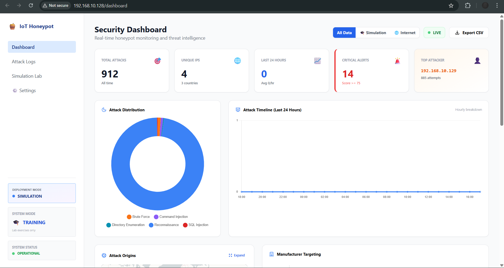
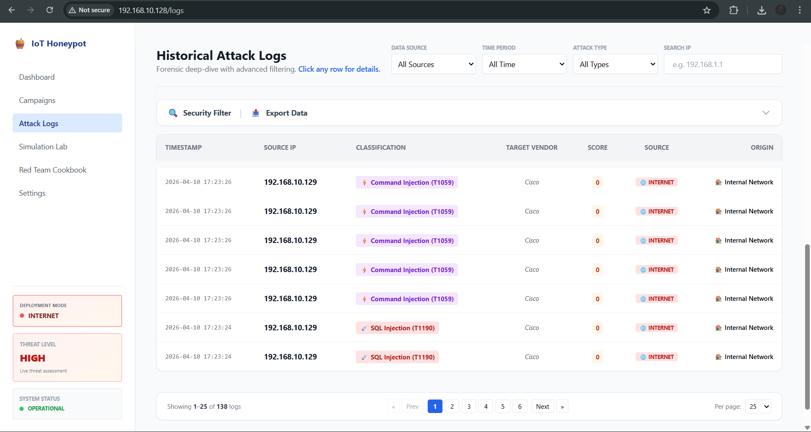
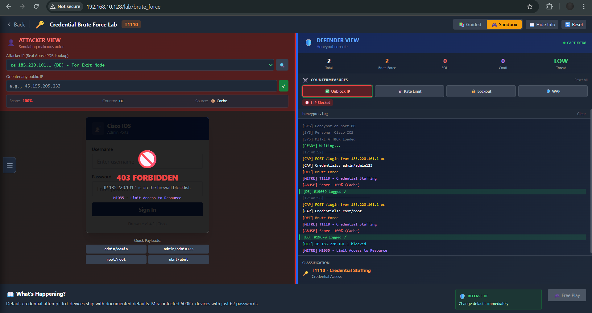
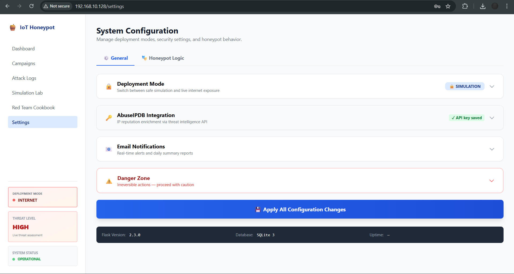

# 🍯 Lightweight HTTP-Based IoT Honeypot

A lightweight, HTTP-based IoT honeypot designed for **cybersecurity research and education**. The system simulates vulnerable IoT web interfaces to capture, classify, and visualize HTTP-based attacks in a controlled environment — serving as both a live threat intelligence sensor and a classroom teaching tool.

> **Final Year Project** — Faculty of Data Science and Information Technology (FDSIT), INTI International University

## ✨ Features

### Core Honeypot Engine
- **Dual-Mode Architecture** — Switch between Simulation Mode (safe classroom exercises) and Internet Mode (real-world traffic capture) without restart
- **Multi-Vendor Persona System** — 10 switchable IoT device personas (Cisco, TP-Link, Netgear, D-Link, Hikvision, Dahua, Axis, etc.) with protocol-level header spoofing
- **Two-Layer Rate Limiting** — Nginx C-level DDoS safety net (30 req/s) + Flask per-IP educational rate limiter with stealth 404 responses
- **Honey Route Network** — 20+ bait endpoints (`/status`, `/config.json`, `/backup.tar.gz`, etc.) that mimic real IoT device paths
- **Admin Path Concealment** — Admin pages hidden from attacker view in Internet Mode

### Threat Intelligence & Classification
- **MITRE ATT&CK Classification** — Automatic categorization of 8 attack types: SQL Injection (T1190), Command Injection (T1059), XSS (T1059.007), Directory Traversal (T1083), Malicious Upload (T1105), Brute Force (T1110), Directory Enumeration (T1083), Reconnaissance (T1595)
- **AbuseIPDB Integration** — IP reputation lookups with local caching (free tier: 1,000 queries/day)
- **Proxy/VPN Detection** — Extracts `usageType` and `isTor` from AbuseIPDB to identify Tor exits, data centers, residential IPs, and VPN/proxy connections
- **Campaign Intelligence** — Session-windowed attack grouping that clusters attacks from the same IP into campaigns based on configurable idle thresholds (30s–10min), with kill chain timeline visualization and AI analysis prompts

### Dashboard & Visualization
- **Real-Time Dashboard** — 5 KPI cards, attack type doughnut chart, hourly timeline, geographic Leaflet.js map, and threat feed table with 5-second auto-refresh
- **Attack Logs** — Searchable history with filters (time, type, source, IP), Security Filter toggle (signal vs noise), server-side pagination, and collapsible toolbar
- **8 MITRE ATT&CK Modals** — Each attack type has a detailed modal with icon, description, 5-step attack story, and 5 defense recommendations
- **Command Reconstruction Engine** — Auto-detects attacker tool from User-Agent and reconstructs the likely command used (sqlmap, hydra, gobuster, ffuf, nmap, xsstrike, curl)
- **AI Analysis Prompt Builder** — Generates structured prompts for free AI tools (Google Gemini, Bing Copilot, ChatGPT) — no API key needed

### Learning Modules
- **Interactive Simulation Lab** — Split-screen attacker/defender interface with regex-scored classification and 4 active countermeasures (IP Block, Rate Limit, Lockout, WAF)
- **Cyber Kill Chain Mission Mode** — Guided 4-phase narrative exercise (Recon → Weaponize → Exploit → Success) with progressive hints and golden payloads
- **Forensic Reconstructor** — 4 botnet investigation scenarios (Mirai, Mozi, Hajime, Web Shell Drop) with 3-step paginated investigation: Detection → Identification → Reconstruction
- **Code & Catch** — 3 scripting lessons (Bash log hunting, Python scanner, Python botnet simulator) with Ace Editor, structural validation, and reference solutions
- **Red Team Cookbook** — 8 attack categories with copy-paste Kali commands (manual curl + automated tool variants), expected honeypot responses, and a full Kill Chain Demo script

### Alerting & Export
- **Email Notifications** — Real-time alerts for high-severity attacks and daily summary reports via Gmail SMTP
- **Data Export** — CSV/JSON export with optional IP anonymization (masks last octet + IPs in payloads) for research sharing

## 🛠️ Tech Stack

| Component | Technology |
|---|---|
| Backend | Python 3, Flask |
| Database | SQLite with SQLAlchemy connection pooling |
| Frontend | HTML5, CSS3 (Tailwind), JavaScript, Chart.js, Leaflet.js, Ace Editor |
| Reverse Proxy | Nginx (HTTP port 80 + HTTPS port 443) |
| Threat Intelligence | AbuseIPDB API (free tier) |
| Email | Gmail SMTP |
| Testing | pytest (classifier + route tests) |
| Deployment | VMware Workstation Pro, host-only network |

## 🏗️ Architecture

```
Attacker (Kali VM: 192.168.10.129)
        │
        ▼
┌─────────────────────────────────────────┐
│  Nginx (Ubuntu VM: 192.168.10.128)      │
│  Ports 80/443                           │
│  ├─ SSL termination (HTTPS)             │
│  ├─ Layer 1 rate limit: 30 req/s        │
│  ├─ X-Forwarded-For: $remote_addr       │
│  └─ Server header spoofing              │
└─────────────┬───────────────────────────┘
              ▼
┌─────────────────────────────────────────┐
│  Flask (127.0.0.1:5000)                 │
│  ├─ ProxyFix middleware                 │
│  ├─ Attack classification (8 types)     │
│  ├─ Layer 2 rate limit (per-IP/hour)    │
│  ├─ IP reputation lookup (AbuseIPDB)    │
│  ├─ Email alerts (SMTP)                 │
│  └─ REST API for dashboard              │
└──────┬──────────────┬───────────────────┘
       ▼              ▼
   SQLite DB     Web Dashboard
  (attacks.db)   (Browser-based)
```

## 🚀 Setup

### Prerequisites

- VMware Workstation Pro (or VirtualBox)
- Ubuntu 24.04.3 LTS (CLI) — Sensor VM (2GB RAM, 4 vCPU recommended)
- Kali Linux — Attacker VM (optional, for penetration testing)
- Python 3.10+
- Nginx

### Installation

```bash
# Clone the repository
git clone https://github.com/kkk0813/HTTP_IoT_Honeypot.git
cd HTTP_IoT_Honeypot

# Install Python dependencies
pip install -r requirements.txt

# Copy and configure settings
cp honeypot_config_example.json honeypot_config.json
# Edit honeypot_config.json with your API keys and SMTP credentials

# Run the honeypot
python3 app.py
```

### Nginx Configuration

```bash
# Copy the provided Nginx config
sudo cp honeypot_nginx.conf /etc/nginx/sites-available/honeypot
sudo ln -s /etc/nginx/sites-available/honeypot /etc/nginx/sites-enabled/

# Optional: Install headers-more module for Server header spoofing
sudo apt install libnginx-mod-http-headers-more-filter

# Test and restart
sudo nginx -t && sudo systemctl restart nginx
```

### Optional: AbuseIPDB API Key

1. Register at [AbuseIPDB](https://www.abuseipdb.com/) (free tier: 1,000 queries/day)
2. Access the admin panel → Settings → AbuseIPDB Integration → Enter API key

### Running Tests

```bash
# Ensure pytest is installed
pip install pytest

# Run all tests
pytest tests/ -v

# Run specific test suites
pytest tests/test_classifier.py -v    # 60 attack classification tests
pytest tests/test_honey_routes.py -v  # Honey route endpoint tests
pytest tests/test_rate_limiter.py -v  # Rate limiting tests
```

## 📖 Usage

1. Access the honeypot at `http://<SENSOR_VM_IP>` — attacker-facing IoT login page
2. Access admin panel at `http://<SENSOR_VM_IP>/honeypot-admin` — credentials set in config
3. Navigate using the sidebar: Dashboard, Attack Logs, Campaigns, Simulation Lab, Cookbook, Settings

### Deployment Modes

| Mode | Purpose | Audience |
|---|---|---|
| **Simulation Mode** | Safe classroom exercises with built-in attack simulation tools | Students, lecturers |
| **Internet Mode** | Real network traffic capture with stealth logging, honey routes, and email alerts | Researchers, advanced users |

## 📁 Project Structure

```
HTTP_IoT_Honeypot/
├── app.py                          # Main Flask app (~1200 lines)
├── internet_routes.py              # Internet Mode middleware + honey routes
├── lab_routes.py                   # Simulation Lab backend
├── notifier.py                     # Email notification system
├── forensic/                       # Forensic Reconstructor module
│   ├── __init__.py                 #   Blueprint + routes
│   ├── scenarios.py                #   4 botnet scenarios
│   └── validator.py                #   3-step answer validation
├── scripting/                      # Code & Catch module
│   ├── __init__.py                 #   Blueprint + routes
│   ├── lessons.py                  #   3 scripting lessons
│   └── validator.py                #   Code structure validation
├── templates/
│   ├── base.html                   # Shared sidebar layout
│   ├── login.html                  # Router admin login (light theme)
│   ├── camera_login.html           # IP Camera NVR login (dark theme)
│   ├── dashboard.html              # Security dashboard
│   ├── logs.html                   # Attack logs + MITRE modals
│   ├── campaigns.html              # Campaign Intelligence
│   ├── simulation.html             # Learning module hub (4 tracks)
│   ├── interactive_lab.html        # Split-screen attacker/defender lab
│   ├── mission_recon.html          # Mission Phase 1: Reconnaissance
│   ├── mission_weapon.html         # Mission Phase 2: Weaponization
│   ├── mission_success.html        # Mission Phase 4: Success
│   ├── cookbook.html                # Red Team Cookbook
│   ├── settings.html               # System configuration (2-tab)
│   ├── mitre.html                  # MITRE ATT&CK reference
│   ├── forensic/
│   │   ├── landing.html            #   Scenario picker
│   │   └── lab.html                #   3-step investigation
│   └── scripting/
│       ├── landing.html            #   Lesson picker
│       └── editor.html             #   Ace Editor workspace
├── tests/
│   ├── conftest.py                 # Shared pytest fixtures
│   ├── test_classifier.py          # 60 attack classifier tests
│   ├── test_honey_routes.py        # Honey route endpoint tests
│   └── test_rate_limiter.py        # Rate limiting tests
├── screenshots/                    # UI screenshots for documentation
├── honeypot_config_example.json    # Template config (safe to push)
├── honeypot_nginx.conf             # Nginx reverse proxy config
├── DefaultCreds-Cheat-Sheet.csv    # Brute force credential wordlist
├── requirements.txt                # Python dependencies
├── LICENSE                         # MIT License
└── README.md
```

## 📸 Screenshots

| Security Dashboard | Attack Logs |
|---|---|
|  |  |

| Interactive Simulation Lab | Settings |
|---|---|
|  |  |

## 🔑 Key Design Decisions

- **Classifier priority ordering** — Directory Traversal checked before Command Injection to prevent `etc/passwd` misclassification
- **XFF header hardening** — Uses `$remote_addr` instead of `$proxy_add_x_forwarded_for` to prevent IP spoofing via injected headers
- **Session windowing for campaigns** — GROUP BY IP alone merges unrelated attacks hours apart; idle gap thresholds create meaningful attack sessions
- **Comment stripping in code validation** — Starter code hints in the scripting module are filtered before keyword matching to prevent false positives
- **Clipboard API fallback** — `navigator.clipboard` requires HTTPS; fallback uses hidden textarea + `execCommand('copy')` for HTTP environments

## 🔮 Future Enhancements

- **Docker containerization** for one-command deployment
- **Canarytoken integration** for broader deception beyond HTTP
- **Code refactoring** to reduce `app.py` size (~1200 lines → modular blueprints)
- **Pyodide-based in-browser code execution** for the scripting module
- **Public internet deployment** with proper firewall rules for real-world data collection

## 📄 License

This project is licensed under the [MIT License](LICENSE).

## ⚠️ Disclaimer

This tool is intended for **educational and authorized research purposes only**. Deploy only in isolated lab environments or with explicit authorization. The authors are not responsible for any misuse of this software.